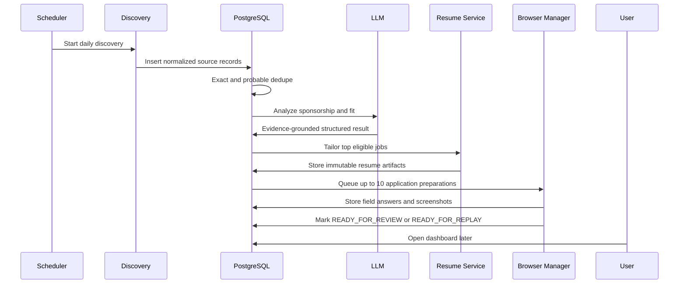
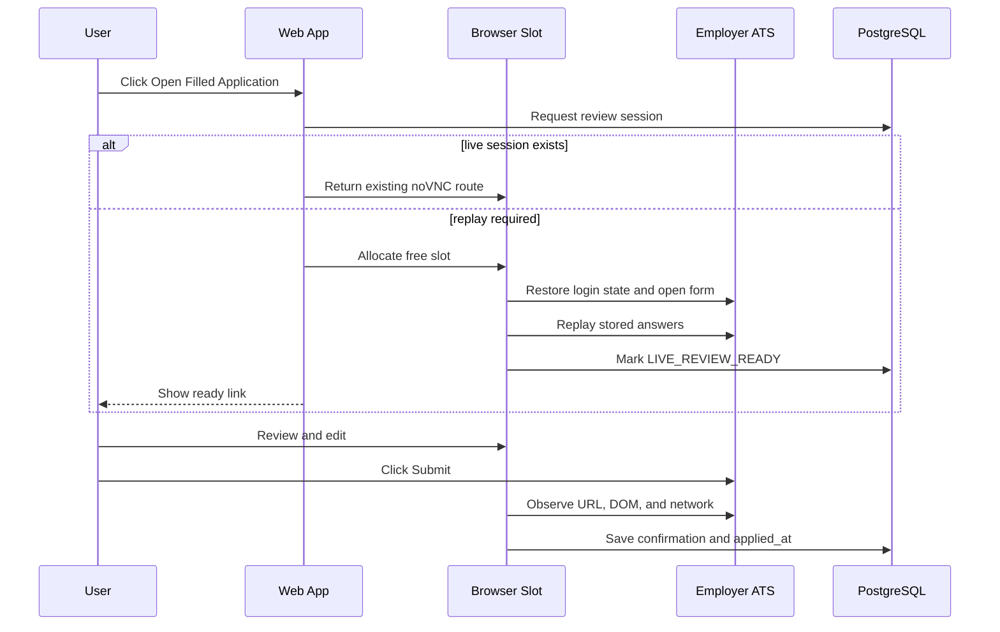
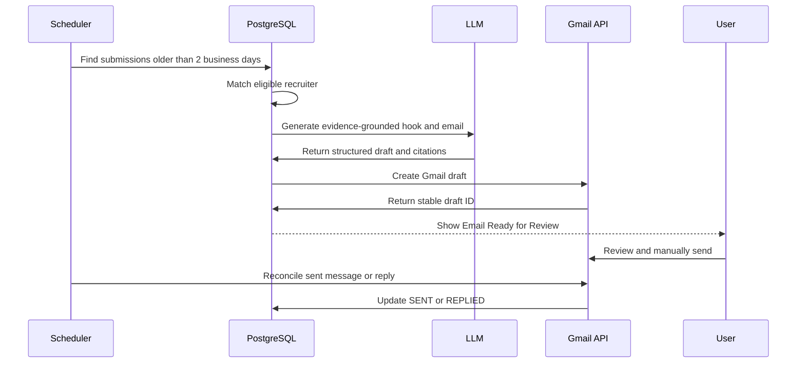

# 6. User Journeys

## 6.1 Daily application preparation

```mermaid
sequenceDiagram
    participant S as Scheduler
    participant D as Discovery
    participant DB as PostgreSQL
    participant AI as LLM
    participant R as Resume Service
    participant B as Browser Manager
    participant U as User

    S->>D: Start daily discovery
    D->>DB: Insert normalized source records
    DB->>DB: Exact and probable dedupe
    DB->>AI: Analyze sponsorship and fit
    AI->>DB: Evidence-grounded structured result
    DB->>R: Tailor top eligible jobs
    R->>DB: Store immutable resume artifacts
    DB->>B: Queue up to 10 application preparations
    B->>DB: Store field answers and screenshots
    B->>DB: Mark READY_FOR_REVIEW or READY_FOR_REPLAY
    U->>DB: Open dashboard later
```

## 6.2 Review and submit

```mermaid
sequenceDiagram
    participant U as User
    participant W as Web App
    participant B as Browser Slot
    participant ATS as Employer ATS
    participant DB as PostgreSQL

    U->>W: Click Open Filled Application
    W->>DB: Request review session
    alt live session exists
        W->>B: Return existing noVNC route
    else replay required
        W->>B: Allocate free slot
        B->>ATS: Restore login state and open form
        B->>ATS: Replay stored answers
        B->>DB: Mark LIVE_REVIEW_READY
        W-->>U: Show ready link
    end
    U->>B: Review and edit
    U->>ATS: Click Submit
    B->>ATS: Observe URL, DOM, and network
    B->>DB: Save confirmation and applied_at
```

## 6.3 Recruiter outreach

```mermaid
sequenceDiagram
    participant S as Scheduler
    participant DB as PostgreSQL
    participant AI as LLM
    participant G as Gmail API
    participant U as User

    S->>DB: Find submissions older than 2 business days
    DB->>DB: Match eligible recruiter
    DB->>AI: Generate evidence-grounded hook and email
    AI->>DB: Return structured draft and citations
    DB->>G: Create Gmail draft
    G->>DB: Return stable draft ID
    DB-->>U: Show Email Ready for Review
    U->>G: Review and manually send
    S->>G: Reconcile sent message or reply
    G->>DB: Update SENT or REPLIED
```

---
